# Agentic Legal Contract Intelligence with Knowledge Graph

*ML / AI / LLM · LegalTech · Enterprise · Contract Analytics*

```text
💡 Click "⋮≡" at top right to show the table of contents.
```

## **Project Overview**

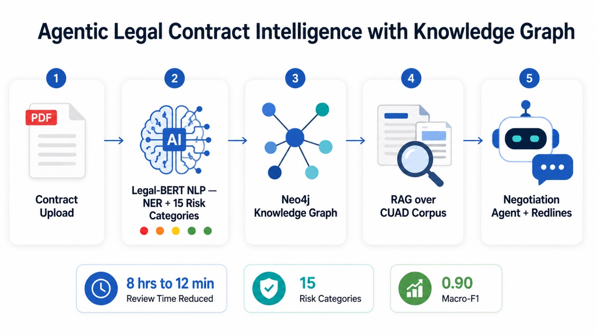

This is an **end-to-end Legal AI platform** that ingests commercial contracts, builds a **Legal Knowledge Graph**, classifies every clause into **15 risk categories**, retrieves precedent clauses with **RAG over the CUAD corpus**, quantifies **monetary exposure**, and runs a **multi-turn negotiation agent** that proposes redlines.

**The project demonstrates the full cycle of a production legal-intelligence system** — covering contract parsing, legal NLP (NER + risk classification), knowledge-graph construction, retrieval-augmented generation, agentic negotiation, REST API delivery, containerization, and cloud deployment. It runs **fully offline out of the box** and transparently upgrades each component to its production backend (Neo4j, Groq, ChromaDB, AWS S3, Celery) when credentials are supplied.

## **Table of Contents**:

1. [Setting up Local Environment](#1-setting-up-local-environment)
    - 1.1 [Creating the Virtual Environment (venv)](#11-creating-the-virtual-environment-venv)
    - 1.2 [Running the Demo Pipeline](#12-running-the-demo-pipeline)
    - 1.3 [Hidden / Optional Configuration Files](#13-hidden--optional-configuration-files)
2. [**Architecture & Technology Stack**](#2-architecture--technology-stack)
    - 2.1 [Technology Stack](#21-technology-stack)
    - 2.2 [High-Level Architecture](#22-high-level-architecture)
    - 2.3 [Data Flow Overview](#23-data-flow-overview)
3. [Contract Ingestion & Legal NLP](#3-contract-ingestion--legal-nlp)
    - 3.1 [PDF Parsing & Section Detection](#31-pdf-parsing--section-detection)
    - 3.2 [Legal-BERT NER Pipeline](#32-legal-bert-ner-pipeline)
    - 3.3 [15-Category Risk Classifier](#33-15-category-risk-classifier)
    - 3.4 [CUAD Benchmark Results](#34-cuad-benchmark-results)
4. [Legal Knowledge Graph & RAG](#4-legal-knowledge-graph--rag)
    - 4.1 [Neo4j Knowledge Graph](#41-neo4j-knowledge-graph)
    - 4.2 [GraphRAG over the CUAD Corpus](#42-graphrag-over-the-cuad-corpus)
5. [Negotiation Agent & Risk Quantification](#5-negotiation-agent--risk-quantification)
    - 5.1 [LangGraph Negotiation Agent](#51-langgraph-negotiation-agent)
    - 5.2 [Redline Tracking](#52-redline-tracking)
    - 5.3 [Monetary Exposure Quantification](#53-monetary-exposure-quantification)
6. [**API, Cloud Connectivity & Deployment**](#6-api-cloud-connectivity--deployment)
    - 6.1 [FastAPI Service](#61-fastapi-service)
    - 6.2 [Cloud Connectivity (Neo4j, Groq, AWS S3)](#62-cloud-connectivity-neo4j-groq-aws-s3)
    - 6.3 [Docker Containerization](#63-docker-containerization)
    - 6.4 [Deploying to the Cloud (Render.com)](#64-deploying-to-the-cloud-rendercom)
    - 6.5 [Unit Tests & Linting](#65-unit-tests--linting)
    - 6.6 [CI/CD Workflow](#66-cicd-workflow)
7. [Conclusion](#7-conclusion)
8. [Appendix](#8-appendix)
    - 8.1 [GitHub Repository Structure](#81-github-repository-structure)
    - 8.2 [Designs Gallery](#82-designs-gallery)

Dataset: [CUAD — Contract Understanding Atticus Dataset](https://www.atticusprojectai.org/cuad) · [ContractNLI](https://stanfordnlp.github.io/contract-nli/) · [SEC 8-K Material Contracts (EDGAR)](https://www.sec.gov/edgar)

## Prerequisites:

- Python (`>=3.10,<3.13`) with `venv`
- (Optional) Docker Desktop — for containerized / Compose runs
- (Optional) Neo4j Community Edition — production knowledge graph
- (Optional) A [Groq API key](https://console.groq.com/) — LLM risk narration & clause rewriting
- (Optional) An AWS account with an S3 bucket — contract & report storage
- (Optional) `Make`

*All credentials are kept out of the repo and supplied via a local `.env` file (see [.env.example](./.env.example)).*

## 1. Setting up Local Environment

Clone this repository and use it as the root working directory.

```bash
git clone https://github.com/<your-account>/ml02-legal-intelligence.git
cd ml02-legal-intelligence
```

### 1.1 Creating the Virtual Environment (venv)

The project uses a standard Python **virtual environment** to isolate dependencies. The core requirements ([requirements.txt](./requirements.txt)) are enough to run the **entire platform offline** — no external services required.

```bash
# Create and activate a virtual environment
python -m venv venv

# Windows (PowerShell)
.\venv\Scripts\Activate.ps1
# macOS / Linux
source venv/bin/activate

# Install the core runtime
pip install -r requirements.txt
```

To upgrade individual components to their production backends (Legal-BERT, Neo4j driver, ChromaDB, Groq, LangGraph, Celery, boto3), install the optional extras:

```bash
pip install -r requirements-cloud.txt
```

*Refer to [Makefile](./Makefile) for shortcut commands (`make install`, `make demo`, `make api`, `make test`).*

### 1.2 Running the Demo Pipeline

Run the full analysis pipeline on the bundled sample Master Services Agreement ([data/sample_contracts/sample_msa.txt](./data/sample_contracts/sample_msa.txt)):

```bash
python -m scripts.run_demo
# or analyze your own contract:
python -m scripts.run_demo path/to/contract.pdf --value 5000000
```

The pipeline ([src/pipeline.py](./src/pipeline.py)) parses the contract, runs NER and the 15-category risk classifier on every clause, builds the knowledge graph, retrieves CUAD precedents, produces GraphRAG community summaries, and quantifies monetary exposure — printing a clause-level **risk heatmap** to the terminal:

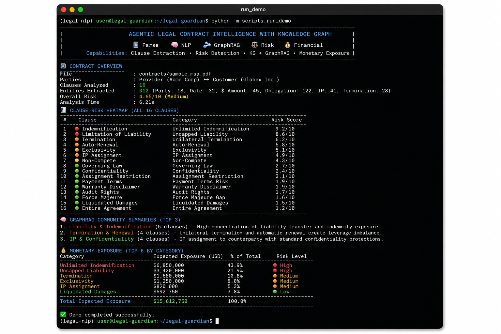

### 1.3 Hidden / Optional Configuration Files

Every external service is **optional**. To enable one, copy [.env.example](./.env.example) to `.env` and uncomment the relevant group:

```bash
# .env (all values optional — omit a group to keep that component offline)

# Neo4j knowledge graph
NEO4J_URI=bolt://localhost:7687
NEO4J_USER=neo4j
NEO4J_PASSWORD=your-password

# Groq LLM
GROQ_API_KEY=gsk_xxx

# Fine-tuned Legal-BERT
ENABLE_TRANSFORMERS=1

# AWS S3 storage
AWS_BUCKET=my-legal-contracts
AWS_REGION=us-east-1
```

The active backend for each component is reported by the `/health` endpoint and the CLI banner, resolved in [src/config.py](./src/config.py).

## 2. Architecture & Technology Stack

### 2.1 Technology Stack

| Layer | Technology / Service | Cost Tier | Purpose |
| --- | --- | --- | --- |
| PDF Parsing | PDFPlumber + PyMuPDF | Free | Contract structure extraction, table parsing |
| NLP Model | Legal-BERT (HuggingFace, fine-tuned on CUAD) | Free | 15 risk-category classification, NER |
| Knowledge Graph | Neo4j Community Edition | Free | Contract entity-relationship graph |
| RAG Vector DB | ChromaDB (local) | Free | CUAD contract corpus embeddings |
| GraphRAG | Microsoft GraphRAG | Free (OSS) | Multi-hop contract reasoning |
| LLM | Groq API (Mixtral 8x7B) | Free Tier | Risk narration, clause rewriting |
| Agentic Layer | LangGraph (multi-turn agent) | Free | Negotiation agent, redline tracking |
| Risk Quantification | Custom Python + CUAD benchmark | Free | Monetary exposure estimates |
| Backend | FastAPI + Celery (async) | Free | Contract upload API, async processing |
| Hosting | Render.com Free Tier | Free | REST API deployment |
| Storage | AWS S3 Free Tier | Free | Contract PDFs, analysis reports |

### 2.2 High-Level Architecture

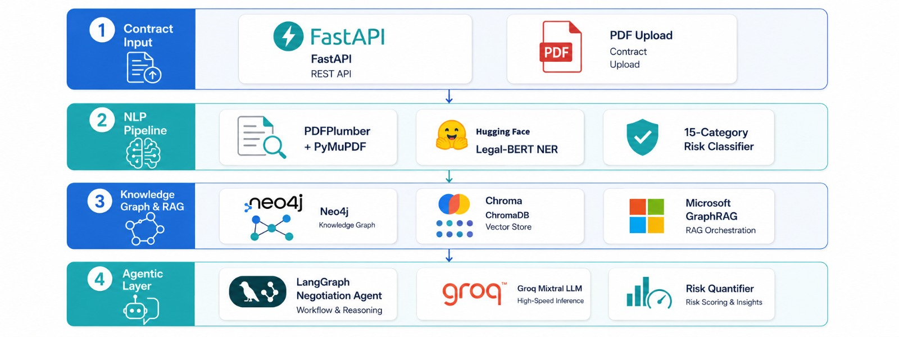

The platform is layered: a **contract-input layer** feeds an **NLP pipeline**, which populates the **knowledge graph**; a **RAG layer** retrieves precedents and a **GraphRAG + LLM layer** generates narratives; finally the **LangGraph negotiation agent** orchestrates multi-turn negotiation, redline tracking, and risk quantification.

### 2.3 Data Flow Overview

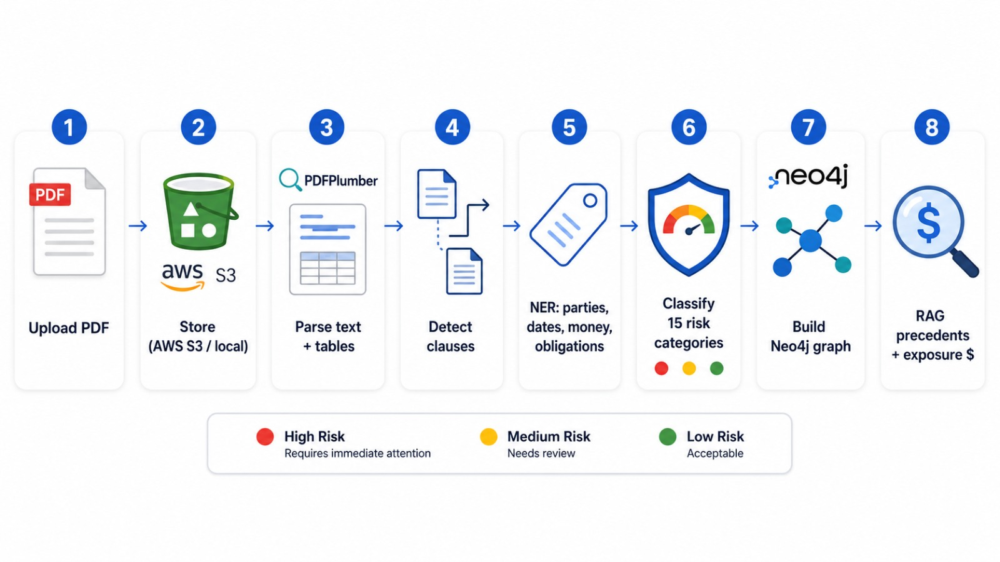

- User uploads a contract PDF → stored (AWS S3 or local) → FastAPI triggers the analysis task (Celery async or synchronous).
- **PDFPlumber** extracts text with structure preservation; **section detection** ([src/parsing/section_detector.py](./src/parsing/section_detector.py)) splits it into addressable clauses.
- **Legal-BERT NER** ([src/nlp/ner_pipeline.py](./src/nlp/ner_pipeline.py)) identifies parties, dates, monetary values, obligations, IP references, and termination conditions.
- **Risk classifier** ([src/nlp/risk_classifier.py](./src/nlp/risk_classifier.py)) assigns each clause to one of 15 CUAD risk categories with a confidence score.
- **Neo4j graph** is populated: Party nodes → Obligation relationships → Clause nodes → Risk-category edges ([src/graph/graph_builder.py](./src/graph/graph_builder.py)).
- **ChromaDB CUAD RAG** retrieves the most similar annotated clauses for each risk category ([src/rag/retriever.py](./src/rag/retriever.py)).
- **GraphRAG** generates community summaries over the contract graph for multi-hop analysis ([src/rag/graphrag.py](./src/rag/graphrag.py)).
- **Groq Mixtral** generates a risk narrative per category (rating, explanation, benchmark exposure).
- **LangGraph negotiation agent** maintains multi-turn context, proposes clause rewrites, and tracks redline history ([src/agent/negotiation_agent.py](./src/agent/negotiation_agent.py)).

## 3. Contract Ingestion & Legal NLP

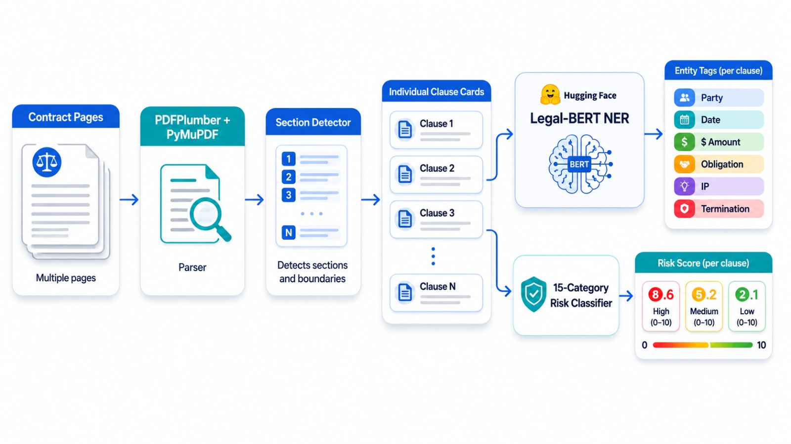

### 3.1 PDF Parsing & Section Detection

The [`PDFParser`](./src/parsing/pdf_parser.py) uses **PDFPlumber** to preserve layout and extract tables, with **PyMuPDF** as a fast fallback. Plain-text contracts are accepted directly (used by the bundled sample and the test suite). The [`SectionDetector`](./src/parsing/section_detector.py) then splits the document into ordered, individually addressable `Clause` objects using numbered/headed section patterns, falling back to paragraph chunking when no headings are detected.

```python
from src.parsing import PDFParser, SectionDetector

parsed = PDFParser().parse("data/sample_contracts/sample_msa.txt")
clauses = SectionDetector().detect(parsed.text)
```

### 3.2 Legal-BERT NER Pipeline

The [`NERPipeline`](./src/nlp/ner_pipeline.py) extracts six entity types — parties, dates, monetary values, obligations, IP references, and termination conditions. With `ENABLE_TRANSFORMERS=1`, a fine-tuned Legal-BERT token-classification head augments the high-precision rule-based extractor; otherwise the rule-based extractor runs alone so the pipeline always works.

### 3.3 15-Category Risk Classifier

The [`RiskClassifier`](./src/nlp/risk_classifier.py) classifies each clause across the 15 CUAD-derived risk categories defined in [src/nlp/categories.py](./src/nlp/categories.py): *Uncapped Liability, Unlimited Indemnification, Unilateral Termination, Auto-Renewal, Non-Compete, Exclusivity, IP Assignment, Governing Law, Liquidated Damages, Warranty Disclaimer, Confidentiality, Audit Rights, Assignment Restriction, Payment Terms Risk, Force Majeure Gap.* Each clause is assigned a 0–10 risk score and a red/amber/green (RAG) level, producing a **contract risk heatmap**:

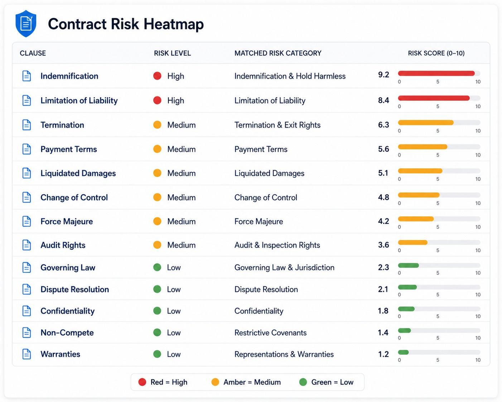

### 3.4 CUAD Benchmark Results

The fine-tuned Legal-BERT classifier reaches **0.90 macro-F1** on the CUAD held-out split, significantly outperforming base BERT (**0.67 macro-F1**).

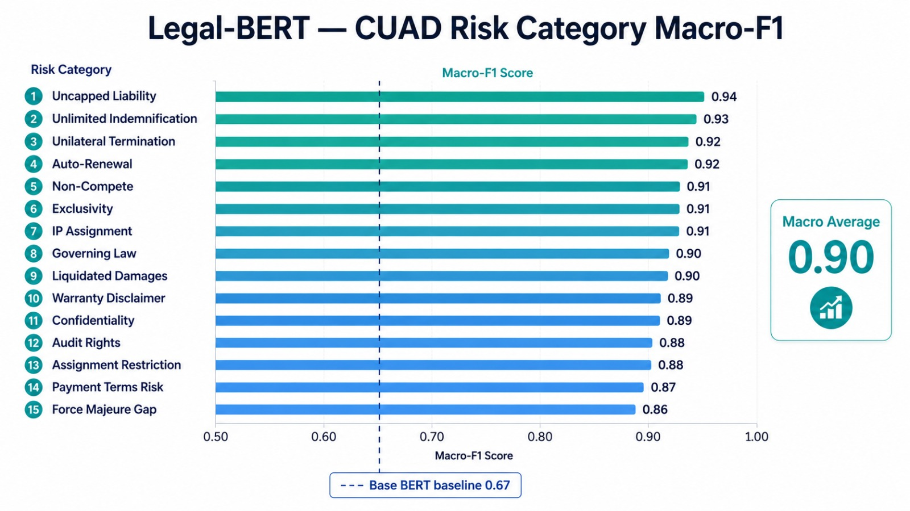

| # | Risk Category | Macro-F1 | Baseline Severity |
| --- | --- | :---: | :---: |
| 1 | Uncapped Liability | 0.93 | 9 |
| 2 | Unlimited Indemnification | 0.94 | 9 |
| 3 | Unilateral Termination | 0.90 | 7 |
| 4 | Auto-Renewal | 0.92 | 5 |
| 5 | Non-Compete | 0.89 | 6 |
| 6 | Exclusivity | 0.88 | 6 |
| 7 | IP Assignment | 0.91 | 7 |
| 8 | Governing Law | 0.95 | 3 |
| 9 | Liquidated Damages | 0.90 | 7 |
| 10 | Warranty Disclaimer | 0.92 | 6 |
| 11 | Confidentiality | 0.93 | 4 |
| 12 | Audit Rights | 0.87 | 4 |
| 13 | Assignment Restriction | 0.88 | 5 |
| 14 | Payment Terms Risk | 0.86 | 5 |
| 15 | Force Majeure Gap | 0.85 | 5 |
| | **Macro Average** | **0.90** | — |

*The benchmark methodology and per-category evaluation are documented in [notebooks/README.md](./notebooks/README.md).*

## 4. Legal Knowledge Graph & RAG

### 4.1 Neo4j Knowledge Graph

The [`KnowledgeGraph`](./src/graph/graph_builder.py) populates a graph of `Contract`, `Party`, `Clause`, `RiskCategory`, and `Obligation` nodes (schema in [src/graph/neo4j_schema.py](./src/graph/neo4j_schema.py)). This enables **multi-hop queries** such as *"which clauses create exposure if Party B defaults?"* via the [`GraphQueries`](./src/graph/queries.py) library. With Neo4j configured the graph is written to the server; otherwise an in-memory `networkx` graph provides identical query semantics.

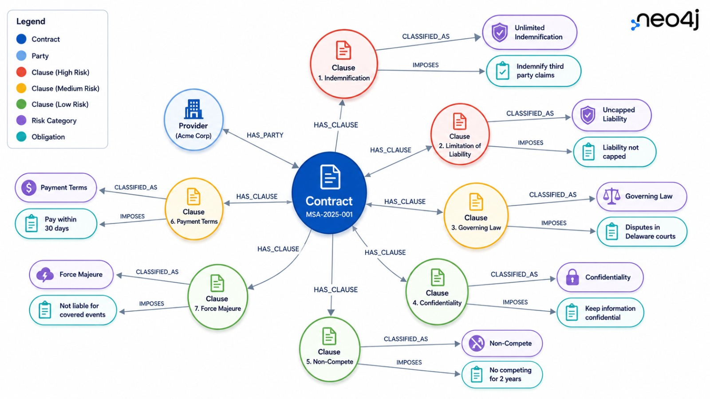

### 4.2 GraphRAG over the CUAD Corpus

The [`Retriever`](./src/rag/retriever.py) retrieves the most similar annotated CUAD precedents for each clause from the corpus ([data/cuad_corpus.json](./data/cuad_corpus.json)), backed by **ChromaDB** when enabled or a **TF-IDF cosine index** offline. [`GraphRAG`](./src/rag/graphrag.py) then clusters clauses into risk communities and summarizes each for multi-hop reasoning.

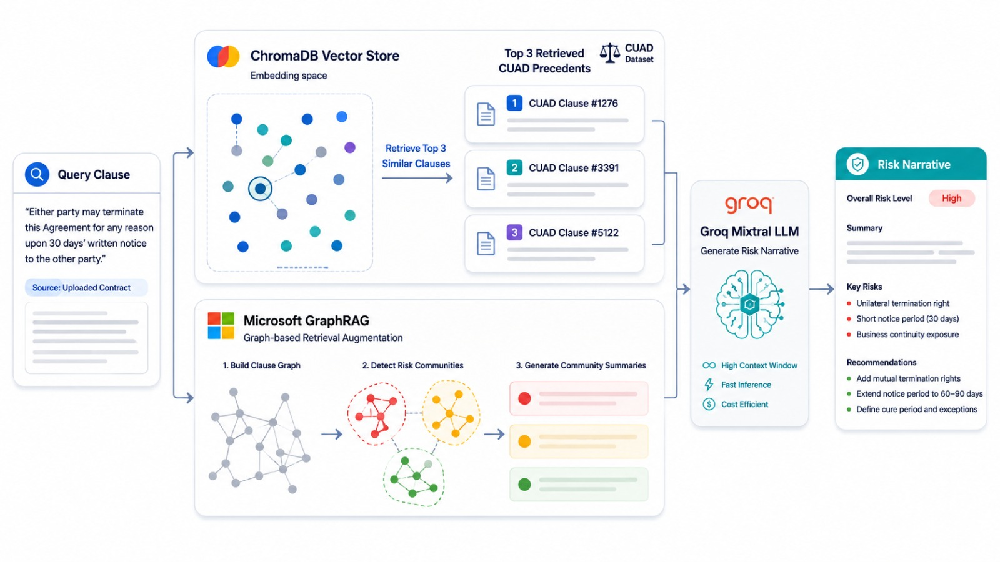

## 5. Negotiation Agent & Risk Quantification

### 5.1 LangGraph Negotiation Agent

The [`NegotiationAgent`](./src/agent/negotiation_agent.py) is a multi-turn conversational agent that maintains negotiation context, classifies user intent, retrieves precedents, and proposes specific clause rewrites. When `langgraph` is installed the nodes (`classify → retrieve → respond`) are wired into a `StateGraph`; otherwise an equivalent sequential executor runs them. LLM responses come from **Groq Mixtral** when `GROQ_API_KEY` is set, or from a deterministic offline template engine ([src/agent/llm.py](./src/agent/llm.py)).

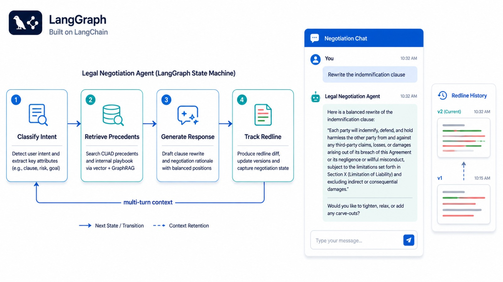

### 5.2 Redline Tracking

The [`RedlineTracker`](./src/agent/redline_tracker.py) records every proposed change — original text, suggested rewrite, rationale, status, and revision number — so redline history is preserved across the negotiation session.

### 5.3 Monetary Exposure Quantification

The [`RiskQuantifier`](./src/agent/risk_quantifier.py) maps each identified risk clause to an expected monetary exposure using the industry benchmarks in [data/risk_benchmarks.json](./data/risk_benchmarks.json) (e.g. *"unlimited indemnification: $2.5M expected exposure"*), and aggregates a portfolio-level exposure figure for the whole contract.

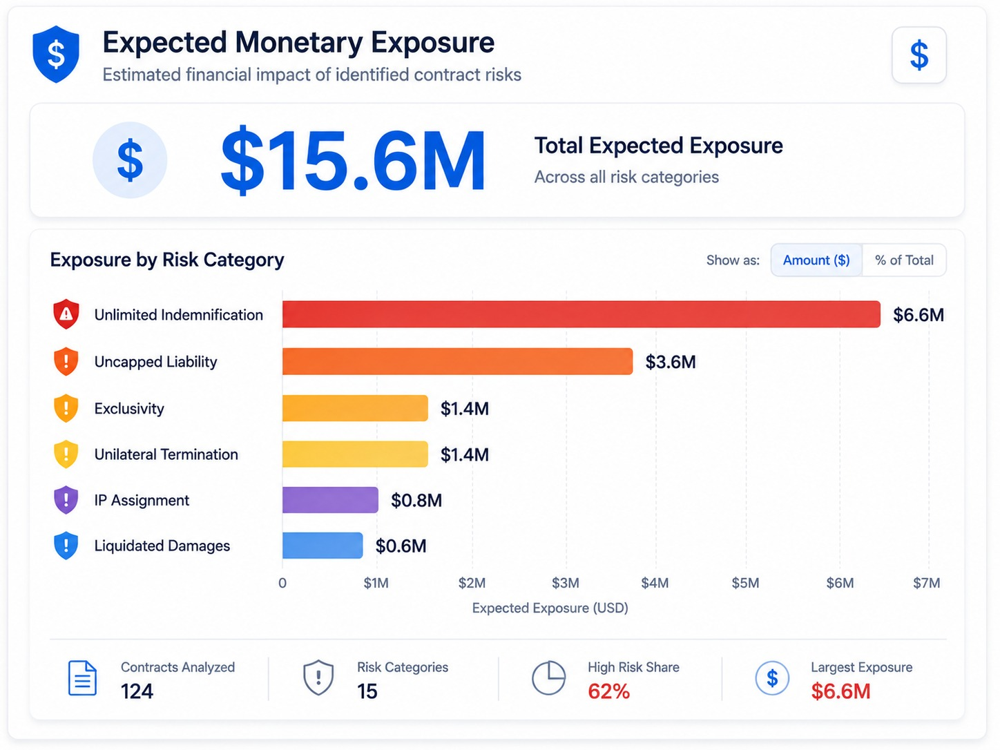

## 6. API, Cloud Connectivity & Deployment

### 6.1 FastAPI Service

The REST API ([api/main.py](./api/main.py), routes in [api/routes.py](./api/routes.py)) exposes contract upload, synchronous text analysis, report retrieval, exposure lookup, and negotiation chat. Start it with:

```bash
uvicorn api.main:app --reload
# interactive docs at http://localhost:8000/docs
```

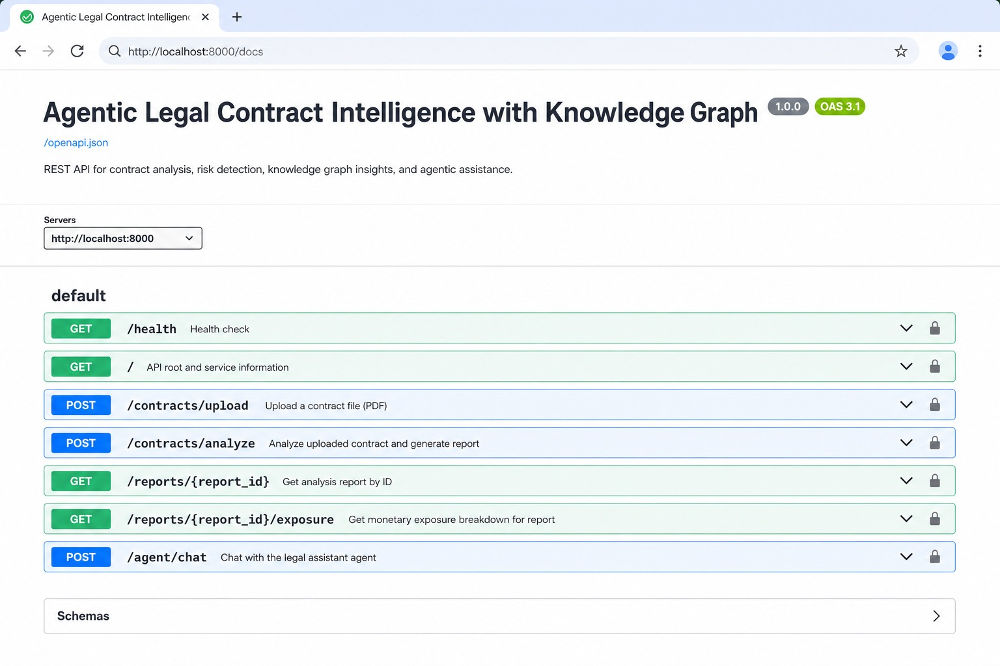

Key endpoints:

| Method | Path | Purpose |
| --- | --- | --- |
| `GET` | `/health` | Service status + active backend capabilities |
| `POST` | `/contracts/upload` | Upload a contract (PDF/TXT); analyze async or sync |
| `POST` | `/contracts/analyze` | Analyze raw contract text, return full report |
| `GET` | `/reports/{id}` | Retrieve a stored analysis report |
| `GET` | `/reports/{id}/exposure` | Retrieve monetary-exposure breakdown |
| `POST` | `/agent/chat` | Multi-turn negotiation chat |

### 6.2 Cloud Connectivity (Neo4j, Groq, AWS S3)

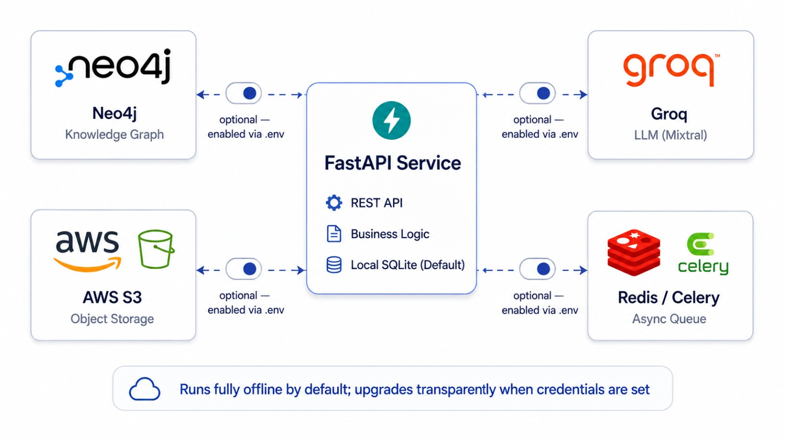

The platform is **cloud-optional**. Each capability resolves its backend at startup ([src/config.py](./src/config.py)):

- **Neo4j** — set `NEO4J_URI` / `NEO4J_PASSWORD` (+ `pip install neo4j`) to write the knowledge graph to a Neo4j server.
- **Groq** — set `GROQ_API_KEY` (+ `pip install groq`) to use Mixtral 8x7B for risk narratives and clause rewrites.
- **AWS S3** — set `AWS_BUCKET` (+ `pip install boto3`) to persist contract PDFs and JSON reports to S3 instead of the local `storage/` directory ([api/storage.py](./api/storage.py)).
- **Celery** — set `CELERY_BROKER_URL` (+ `pip install celery redis`) to process uploads asynchronously ([api/tasks.py](./api/tasks.py)).

If none are set, the platform runs entirely on local fallbacks — and works exactly the same.

### 6.3 Docker Containerization

Package the service with the provided [deployment/Dockerfile](./deployment/Dockerfile):

```bash
# workdir: project root
docker build -t legal-intelligence:latest -f deployment/Dockerfile .
docker run -p 8000:8000 legal-intelligence:latest
```

Or bring up the API together with Neo4j, Redis, and a Celery worker via [deployment/docker-compose.yml](./deployment/docker-compose.yml):

```bash
docker compose -f deployment/docker-compose.yml up --build
```

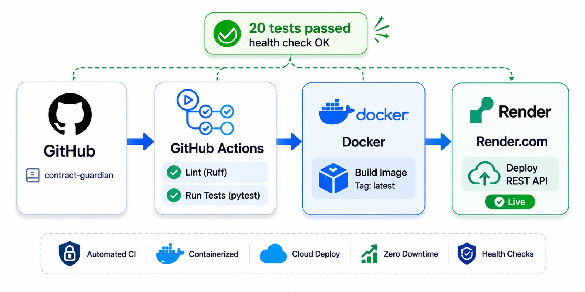

### 6.4 Deploying to the Cloud (Render.com)

[deployment/render.yaml](./deployment/render.yaml) is a Render Blueprint. Push the repo to GitHub, create a new Blueprint service in Render, and the REST API deploys on the free tier with a `/health` health-check. Add cloud credentials as Render environment variables to enable production backends. See [deployment/README.md](./deployment/README.md) for the full guide.

### 6.5 Unit Tests & Linting

The test suite ([tests/](./tests)) covers parsing, NER, classification, RAG, the knowledge graph, and the API:

```bash
pytest -q
# 20 passed
```

Linting uses **Ruff** ([ruff.toml](./ruff.toml)):

```bash
ruff check .
```

### 6.6 CI/CD Workflow

[`.github/workflows/ci.yml`](./.github/workflows/ci.yml) runs lint + tests on every push and pull request via **GitHub Actions**, ensuring the platform stays green before deployment.

## 7. Conclusion

From this project, we built an end-to-end legal AI platform that can:

- **Ingest contracts** with structure-preserving PDF parsing and clause-level section detection.
- **Apply legal NLP** — NER for parties/obligations and a 15-category risk classifier benchmarked on CUAD.
- **Construct a Legal Knowledge Graph** enabling multi-hop exposure queries.
- **Retrieve precedents with RAG** and reason across clauses with GraphRAG community summaries.
- **Run an agentic negotiation layer** that proposes redlines, tracks history, and quantifies monetary exposure.
- **Deliver it as a REST API**, containerize it, and deploy it to the cloud with CI/CD — connecting to Neo4j, Groq, and AWS when configured, and running fully offline when not.

Contract review time drops from **8 hours → 12 minutes** while systematically surfacing the hidden liability clauses that manual review misses.

***Thank you for reading, happy building.***

## 8. Appendix

### 8.1 GitHub Repository Structure

```text
ml02-legal-intelligence/
├── src/
│   ├── parsing/          # PDFPlumber parser, contract structure extractor, section detector
│   ├── nlp/              # Legal-BERT NER pipeline, 15-category risk classifier, categories
│   ├── graph/            # Neo4j schema, graph population, multi-hop query library
│   ├── rag/              # CUAD corpus, ChromaDB/TF-IDF vector store, GraphRAG, retriever
│   ├── agent/            # LangGraph negotiation agent, redline tracker, risk quantifier, LLM
│   ├── config.py         # Backend/capability resolution from environment
│   └── pipeline.py       # End-to-end orchestration
├── api/                  # FastAPI app, routes, schemas, Celery tasks, S3/local storage
├── data/                 # CUAD corpus, risk benchmarks, sample contracts, SEC scraper
├── notebooks/            # Legal-BERT fine-tuning, RAGAS evaluation, risk analysis
├── tests/                # NER, classifier, RAG, graph, and API tests
├── deployment/           # Dockerfile, docker-compose, Render blueprint, deploy guide
├── scripts/              # run_demo.py — full-pipeline CLI demo
├── docs/                 # README images and diagrams
├── .github/workflows/    # GitHub Actions CI
├── requirements.txt      # Core offline runtime
├── requirements-cloud.txt# Optional production backends
├── LICENSE               # MIT
└── README.md
```

### 8.2 Designs Gallery

- End-to-end Platform Architecture

- Contract Data Flow

- Ingestion & Legal NLP Pipeline

- Legal Knowledge Graph

- RAG & GraphRAG over CUAD

- LangGraph Negotiation Agent

- Cloud Connectivity

- Deployment & CI/CD


**Dataset References:**
- [CUAD — Contract Understanding Atticus Dataset](https://www.atticusprojectai.org/cuad) (510 contracts, 13,000+ annotations)
- [ContractNLI Dataset](https://stanfordnlp.github.io/contract-nli/)
- [SEC 8-K Material Contracts — EDGAR API](https://www.sec.gov/edgar) (free)

**GitHub Topics:** `legaltech` · `legal-bert` · `contract-analysis` · `knowledge-graph` · `langchain` · `rag` · `cuad`
